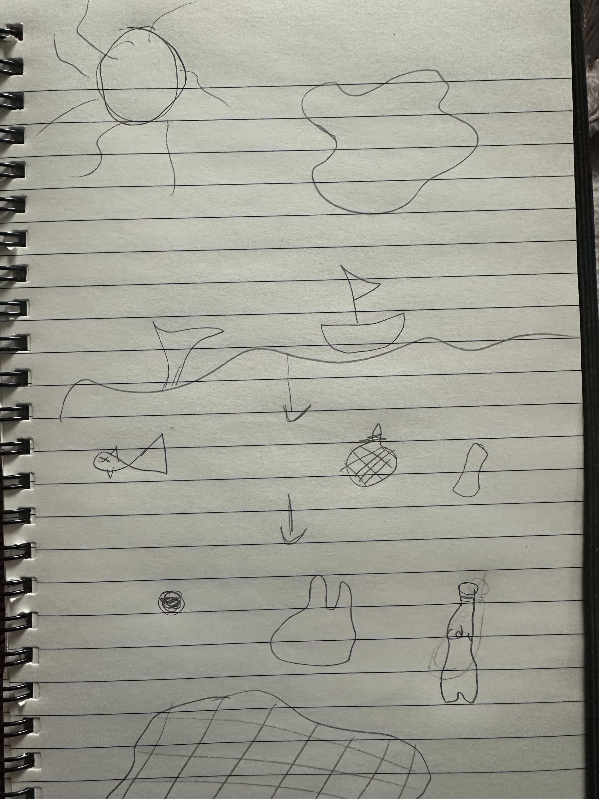

# IDG1293 Advanced CSS: Oblig 3

## Project Overview and Purpose
This project includes an interactive website that uses scroll telling and storytelling. The goal is to raise awareness about one of the UN’s Sustainable Development Goals (SDGs) through visuals, animations, and interactive elements. We wanted to inform, inspire, and get people thinking, while also exploring tools like SVG and CSS drawings, JavaScript animations, and SASS and BEM.

This project is a scrollytelling that focuses on Sustainable Development Goal 14: Life Below Water. The idea is to tell a visual story that shows how life in the ocean is being affected by pollution and climate change.

## Brainstorming 
- Points discussed during the braimstorming session.

## Storyboard

The story is split into several parts. First, we start above the water, where everything looks calm and beautiful. Then, as the user scrolls down, they dive deeper into the ocean. The water gets darker and we see more and more trash and damage to marine life. In the last part, the story shifts to what we can do to fix things and protect the ocean. The goal is to make people more aware of the problem and encourage them to take action.

## Technology Stack
- Technology stack employed and list of animations, interactions and observers implemented.

## How to Get Started
Instructions for getting started 

Link to Github pages: 

## Content - Text and SVG elements
Text content retrieved from: https://sdgs.un.org/goals/goal14#progress_and_info 
SVGs retrieved from: https://www.svgrepo.com/ 

### Part 1: Above the surface 
Did you know that oceans cover more than 70% of our planet? 
They're like the Earth's life support system, providing food and homes for billions of people and animals. 

### Part 2: The ocean’s beauty
Beneath the waves is an underwater paradise — coral reefs, sparkling fish, and all kinds of creatures. 

The ocean regulates our climate, provides food, and is home to amazing ecosystems.

Click the arrow to dive in and see what’s really going on beneath the surface!

### Part 3: The threats and ocean’s decline
Things are changing and the oceans are in trouble. 

The ocean isn't the beautiful place it once was. Pollution is everywhere: plastic waste, oil spills, abandoned fishing nets. 

Every year, millions of tons of plastic end up in the ocean, harming fish, coral reefs, and even the air we breathe.

### Part 4: Call to action
It’s time to act. Together, we can make a real difference and protect the ocean for future generations.

So, what can you do? 

We can all make a difference! Use less plastic, support eco-friendly brands, and get involved in beach cleanups. Every small action counts!

The ocean needs us more than ever, and together, we can make a real impact. Let’s step up and show some love for the sea! 

Button: Join to save the ocean
Link: read more
